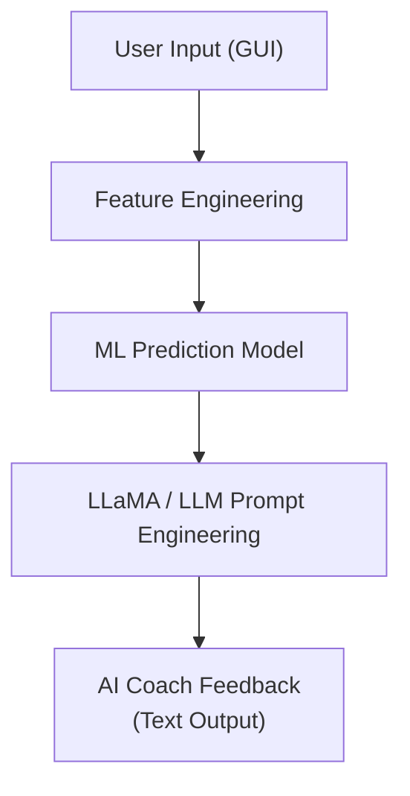
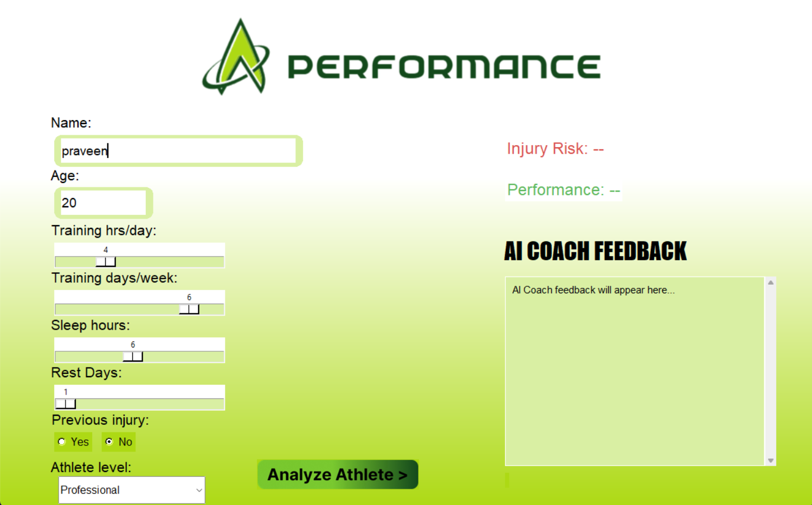
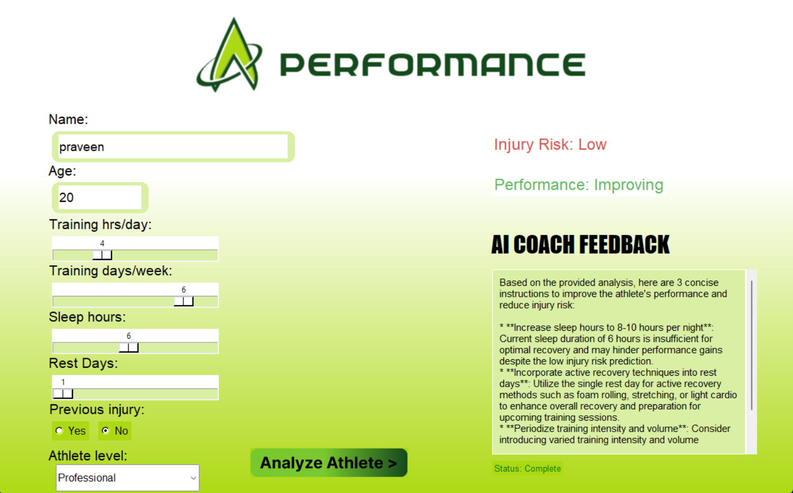

# 🏃‍♂️ A-Performance  
### AI-Powered Athlete Performance & Injury Risk Analyzer

**A-Performance** is an intelligent desktop application that combines  
**Machine Learning (ML)** and **Large Language Models (LLaMA)** to analyze athlete training data, predict injury risk, and generate **human-like AI coaching feedback**.

This project bridges **sports science + machine learning + generative AI**, making it suitable for academic, research, and portfolio use.

---

## 🚀 Key Highlights

- 🤖 Machine Learning–based injury risk & performance prediction
- 🧠 LLaMA-powered AI Coach for natural language feedback
- 📊 Feature-driven athlete analysis
- 🎚️ Interactive Tkinter GUI
- ⚠️ Injury prevention insights
- 📈 Performance optimization recommendations

---

## 🧠 System Architecture

## 🖼️ Application Screenshots

### 🔹 Before Analysis
Athlete data input before AI processing.

---

### 🔹 After Analysis
ML predictions + LLaMA-generated AI coaching feedback.

---

## 📊 Machine Learning Component

The ML model evaluates **training load vs recovery balance** using structured features such as:

- Training hours per day
- Training days per week
- Sleep duration
- Rest days
- Previous injury history
- Athlete experience level

### 🎯 ML Outputs
- **Injury Risk Classification**  
  `Low / Medium / High`
- **Performance Trend**  
  `Declining / Stable / Improving`

> The model is designed to highlight overtraining risks and recovery deficiencies.

---

## 🧠 LLaMA-Powered AI Coach (Generative AI)

After ML inference, the prediction results are passed into a **LLaMA-based Large Language Model** using **prompt engineering**.

### 🔍 What LLaMA Does
- Interprets ML predictions
- Converts numerical outputs into **human-like coaching advice**
- Generates **actionable, contextual feedback**
- Adapts tone based on injury risk and performance status

### 🗣️ Example AI Feedback
- Sleep optimization guidance
- Recovery & rest day strategies
- Training volume and intensity adjustments
- Injury prevention recommendations

This makes the system behave like a **virtual AI coach**, not just a prediction tool.

---

## 🧪 Inputs Used for Analysis

| Category | Description |
|-------|------------|
| Age | Athlete age |
| Training Load | Hours/day & days/week |
| Recovery | Sleep hours & rest days |
| Injury History | Previous injuries |
| Athlete Level | Beginner / Intermediate / Professional |

---

## 🛠️ Technologies Used

- **Python**
- **Tkinter** – GUI
- **NumPy** – numerical processing
- **Scikit-learn** – ML modeling
- **LLaMA / LLM API** – AI feedback generation
- **Prompt Engineering** – contextual coaching output
